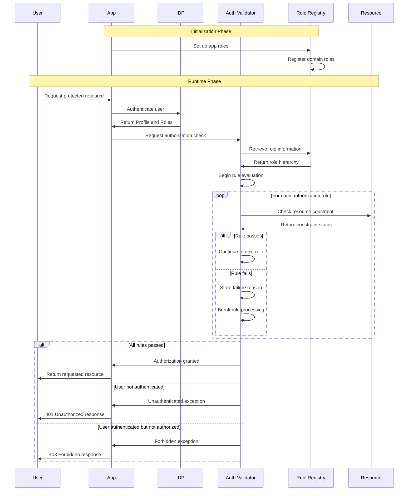

# Authorization Flow

```mermaid
sequenceDiagram
    participant User
    participant B as App
    participant I as IDP
    participant A as Auth Validator
    participant D as Role Registry
    participant R as Resource
    
    Note over B,D: Initialization Phase
    B->>D: Set up app roles
    D->>D: Register domain roles
    
    Note over User,R: Runtime Phase
    User->>B: Request protected resource
    B->>I: Authenticate user
    I->>B: Return Profile and Roles
    B->>A: Request authorization check
    A->>D: Retrieve role information
    D->>A: Return role hierarchy
    
    A->>A: Begin rule evaluation
    
    loop For each authorization rule
        A->>R: Check resource constraint
        R->>A: Return constraint status
        
        alt Rule passes
            A->>A: Continue to next rule
        else Rule fails
            A->>A: Store failure reason
            A->>A: Break rule processing
        end
    end
    
    alt All rules passed
        A->>B: Authorization granted
        B->>User: Return requested resource
    else User not authenticated
        A->>B: Unauthenticated exception
        B->>User: 401 Unauthorized response
    else User authenticated but not authorized
        A->>B: Forbidden exception
        B->>User: 403 Forbidden response
    end
```
