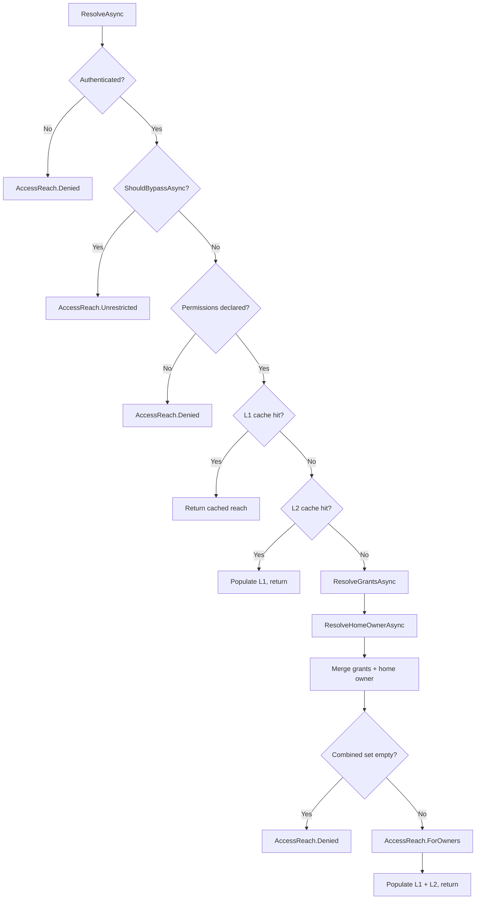

# Grants (ReBAC)

## Relationship-Based Access Control for Cirreum Applications

Grants is Cirreum's opt-in ReBAC (Relationship-Based Access Control) system that
**augments the existing authorization pipeline** — it does not replace RBAC or ABAC.
The base authorization system (roles, resource authorizers, policy validators) continues
to work exactly as before. Grants adds a new dimension: *"for this operation, which
owners can this caller reach?"* — answered before the handler runs, without the handler
knowing anything about grant tables or relationships.

Grants integrates into the existing three-stage authorization pipeline as **Stage 1 Step 0**,
running before scope evaluators, resource authorizers, and policy validators. Resources
that don't implement a Granted interface are completely unaffected — the grant gate is
a no-op pass with zero overhead.

---

## Table of Contents

1. [Core Concepts](#core-concepts)
2. [Architecture](#architecture)
3. [Domain Resolution](#domain-resolution)
4. [Request Interfaces](#request-interfaces)
5. [CRL Enforcement](#crl-enforcement)
6. [Permission Model](#permission-model)
7. [Reach Resolution Flow](#reach-resolution-flow)
8. [Caching](#caching)
9. [Discovery & Analysis](#discovery--analysis)
10. [DI Registration](#di-registration)
11. [Configuration](#configuration)
12. [Design Decisions](#design-decisions)

---

## Core Concepts

| Concept | Description |
|---------|-------------|
| **Grant** | A stored relationship: *"caller X holds permission P on owner Y"* |
| **Domain** | A bounded context (e.g., Issues, Documents) derived from the C# namespace convention |
| **Permission** | A feature-scoped capability (e.g., `issues:delete`, `issues:read`) |
| **AccessReach** | The computed set of owners a caller can touch for a given operation |
| **CRL** | Command / Read / List — the three grant-aware operation patterns |

### What Grants Is Not

- **Not RBAC** — roles live in Stage 2 resource authorizers. Grants don't replace roles;
  they answer *"which owners"*, not *"which actions"*.
- **Not a grant store** — Core defines the pipeline and contracts. The app implements
  `IGrantResolver` to query its own grants table.
- **Not mandatory** — if you never call `AddAccessGrants`, the pipeline behaves exactly
  as before. Zero overhead, zero configuration.

---

## Architecture

```text
                         ┌──────────────────────────────────────────────────────┐
                         │                 Authorization Pipeline                │
                         ├──────────────────────────────────────────────────────┤
                         │ Stage 1 — Scope (first-failure short-circuit)        │
                         │   Step 0: GrantEvaluator (if resource is Granted)    │  ← Grants
                         │   Step 0: OwnerScopeEvaluator (if Owner-Scoped)      │
                         │   Step 1: IScopeEvaluator[] (app-provided, optional)  │
                         │                                                      │
                         │ Stage 2 — Resource (aggregate, then short-circuit)   │
                         │   ResourceAuthorizerBase<T> (roles, ABAC rules)      │
                         │                                                      │
                         │ Stage 3 — Policy (aggregate)                         │
                         │   IPolicyValidator[] (hours, quotas, kill-switches)  │
                         └──────────────────────────────────────────────────────┘
```

### Component Roles

```text
┌─────────────────────────────────────────────────────────────────────────────────────┐
│                              App Layer                                              │
│                                                                                     │
│   // Domain derived from namespace: MyApp.Domain.Issues.Commands → "issues"         │
│                                                                                     │
│   public class AppGrantResolver : IGrantResolver            ← App writes            │
│   {                                                                                 │
│       ResolveGrantsAsync(...)  → queries grants table (uses context.DomainFeature)  │
│       ShouldBypassAsync(...)   → admin role check (optional)                        │
│       ResolveHomeOwnerAsync(.) → home tenant (optional)                             │
│   }                                                                                 │
└─────────────────────────────────┬───────────────────────────────────────────────────┘
                                  │
                                  ▼
┌─────────────────────────────────────────────────────────────────────────────────────┐
│                              Core Layer (sealed, no extension points)               │
│                                                                                     │
│   GrantBasedAccessReachResolver  ← orchestrator                                     │
│     • Bypass check (live, never cached)                                             │
│     • L1 scoped cache → L2 cross-request cache → cold-path resolution               │
│     • Merges grants + home owner → AccessReach                                      │
│                                                                                     │
│   GrantEvaluator  ← CRL enforcement                                                │
│     • Command: OwnerId ∈ reach (pre-handler)                                       │
│     • Read: stash reach for post-fetch check, or OwnerId ∈ reach when supplied      │
│     • List: OwnerIds ⊆ reach, stamp when null                                      │
│                                                                                     │
│   AccessReach  ← the gate's output                                                  │
│     • Denied (empty set) / Unrestricted (no bound) / Bounded (explicit owners)      │
└─────────────────────────────────────────────────────────────────────────────────────┘
```

---

## Domain Resolution

The domain feature is derived structurally from the C# namespace convention — no
marker interface or attribute is needed:

```text
MyApp.Domain.Issues.Commands.DeleteIssue  →  domain = "issues"
MyApp.Domain.Admin.Queries.ListUsers      →  domain = "admin"
```

`DomainFeatureResolver` finds the first segment after `"Domain"` in the type's namespace
and lowercases it. The resolved domain is available on `AuthorizationContext.DomainFeature`
and `RequestContext.DomainFeature`.

---

## Request Interfaces

Grants provides composable interfaces that layer on top of existing Conductor request
types. Each operation pattern requires **one interface** — no marker interfaces or
generic domain parameters:

| Interface | Base | Property | Scope |
|-----------|------|----------|-------|
| `IGrantedCommand` | `IAuthorizableCommand` | `OwnerId` (scalar) | Single-owner write (void) |
| `IGrantedCommand<TResponse>` | `IAuthorizableCommand<TResponse>` | `OwnerId` (scalar) | Single-owner write with response |
| `IGrantedRead<TResponse>` | `IAuthorizableQuery<TResponse>` | `OwnerId` (scalar) | Single-owner read |
| `IGrantedCacheableRead<TResponse>` | `ICacheableQuery<TResponse>` | `OwnerId` + `CallerAccessScope` | Cacheable single-owner read |
| `IGrantedList<TResponse>` | `IAuthorizableQuery<TResponse>` | `OwnerIds` (plural) | Cross-owner query |

### Example

```csharp
[RequiresPermission("delete")]
public sealed record DeleteIssue(string Id) : IGrantedCommand {
    public string? OwnerId { get; set; }
}

[RequiresPermission("read")]
public sealed record GetIssue(string Id) : IGrantedRead<Issue> {
    public string? OwnerId { get; set; }
}

[RequiresPermission("read")]
public sealed record ListIssues : IGrantedList<IReadOnlyList<Issue>> {
    public IReadOnlyList<string>? OwnerIds { get; set; }
}
```

---

## CRL Enforcement

The `GrantEvaluator` enforces timing rules per operation kind:

### Command

```text
OwnerId supplied  →  OwnerId ∈ reach? Pass : Deny
OwnerId null:
  • Global caller         →  Deny (OwnerId required for cross-tenant writes)
  • Unrestricted reach    →  Deny (OwnerId required — ambiguous target)
  • Single-owner reach    →  Auto-enrich OwnerId from reach, Pass
  • Multi-owner reach     →  Deny (ambiguous — caller must specify)
```

### Read

```text
OwnerId supplied  →  OwnerId ∈ reach? Pass : Deny
OwnerId null      →  Pass (Pattern C — reach stashed on IAccessReachAccessor,
                      handler checks post-fetch entity's owner against reach)
```

**Pattern C (existence-hiding):** The handler fetches the entity, checks
`reach.Contains(entity.OwnerId)`, and returns 404 (not 403) if the caller
doesn't have reach — preventing information leakage about resource existence.

### List

```text
OwnerIds supplied  →  OwnerIds ⊆ reach? Pass : Deny
OwnerIds null      →  Stamp OwnerIds from reach (unrestricted = null = no bound)
```

### Pre-flight: User Enabled Check

Before any CRL check, the evaluator verifies the application user is enabled
via `IOwnedApplicationUser.IsEnabled`. Disabled users are denied regardless of grants.

---

## Permission Model

### Declaration

Permissions are declared on any authorizable resource via `[RequiresPermission]`.
On granted resources, permissions drive grant resolution (Stage 1). On non-granted
resources, permissions are available on `ctx.Permissions` for use in resource
authorizers (Stage 2) and policy validators (Stage 3).

```csharp
// Single-arg — feature auto-resolved from namespace convention
[RequiresPermission("delete")]
public sealed record DeleteIssue : IGrantedCommand { ... }

// Two-arg explicit — feature validated against namespace-derived domain
[RequiresPermission("issues", "delete")]
public sealed record ArchiveIssue : IGrantedCommand { ... }

// Permission constant — feature validated
[RequiresPermission(Permissions.Issues.Delete)]
public sealed record PurgeIssue : IGrantedCommand { ... }
```

### Feature Validation

All permissions on a granted resource **must** use the domain's feature. A mismatch
throws `InvalidOperationException` at startup:

```csharp
// Runtime error — feature "audit" does not match domain "issues"
[RequiresPermission("audit", "write")]
public sealed record BadAction : IGrantedCommand { ... }
```

Cross-cutting concerns (audit logging, rate limiting) belong in Stage 2 resource
authorizers or Stage 3 policy validators — not in grant permissions.

### AND Semantics

When multiple permissions are declared, the caller must hold **all** of them on the
target owner(s). Permissions are evaluated with AND semantics, not OR.

---

## Reach Resolution Flow

```text
Hot  (L1 hit):  ResolveAsync → ShouldBypassAsync (live) → L1 dict hit → return
Warm (L2 hit):  ResolveAsync → bypass check → L1 miss → L2 cache hit → L1 populate → return
Cold (miss):    ResolveAsync → bypass check → L1 miss → L2 miss → factory(DB) → L2+L1 populate → return
```

### Resolution Steps



### AccessReach Shapes

| Shape | `OwnerIds` | Meaning |
|-------|-----------|---------|
| **Denied** | `[]` (empty) | Caller has no access for this operation |
| **Unrestricted** | `null` | No bound — cross-tenant visibility (admin bypass) |
| **Bounded** | `["owner-a", "owner-b"]` | Explicit set of reachable owners |

---

## Caching

### Two-Level Cache

| Level | Scope | Storage | Purpose |
|-------|-------|---------|---------|
| **L1** | DI scope (per-request) | `Dictionary` on scoped resolver | Same user hitting 5 granted operations in one request resolves once |
| **L2** | Cross-request | `ICacheService` | Second request from same user is a cache hit |

### Cache Key Format

```
reach:v{version}:{callerId}:{domain}:{permissionSignature}
```

- **`callerId`** — covers both C2M (human users with delegated permissions) and M2M
  (service principals with app roles)
- **`domain`** — the namespace-derived feature name (e.g., `issues`)
- **`permissionSignature`** — sorted, `+`-joined permission operation names (e.g., `delete+write`)

Sorting is required for **cache correctness**: permissions use AND semantics, so
`["delete","archive"]` and `["archive","delete"]` must hit the same entry.

### Cache Tags

| Tag | Purpose |
|-----|---------|
| `reach:caller:{callerId}` | Invalidate all entries for a user |
| `reach:domain:{domain}` | Invalidate all entries for a domain |

### Reach Resolution Telemetry

`GrantBasedAccessReachResolver` records reach resolution events via
`AuthorizationTelemetry.RecordReachResolution()` at every decision point:

| Decision Point | Cache Level Tag | Duration Recorded |
|----------------|-----------------|-------------------|
| Unauthenticated | `denied-early` | No |
| Admin bypass | `bypass` | No |
| No permissions | `denied-early` | No |
| L1 scoped cache hit | `l1-hit` | No |
| L2 cross-request path | `l2` | Yes (ms) |

The L2 duration captures both cache hits (fast) and cold-path resolution
(DB call), giving visibility into cache effectiveness. All instrumentation
is zero-cost when OTel is not attached.

Additionally, the underlying `ICacheService` is wrapped by the
`InstrumentedCacheService` decorator, which separately records cache
hit/miss counters and operation duration at the L2 boundary.

### What's Never Cached

- **Bypass checks** (`ShouldBypassAsync`) — always live. Admin role promotion is immediate.
- **Denied reach** from unauthenticated callers — short-circuit before cache lookup.

### Invalidation

```csharp
// After granting/revoking — invalidate the affected user
await cacheInvalidator.InvalidateCallerAsync(targetUserId);

// After a domain-wide policy change — invalidate all users in this domain
await cacheInvalidator.InvalidateDomainAsync("issues");
```

---

## Discovery & Analysis

Grants integrates into Cirreum's existing authorization discovery and analysis system.
No parallel discovery mechanism is needed.

### Resource Discovery

`DomainModel` automatically detects granted resources during assembly scanning:

- `ResourceTypeInfo.IsGranted` — whether the resource implements a Granted interface
- `ResourceTypeInfo.GrantDomain` — the namespace-derived domain feature
- `ResourceTypeInfo.Permissions` — resolved permissions from `[RequiresPermission]`

These flow through to the serializable `ResourceInfo` export for API transport and
the `DomainCatalog` for organized resource browsing.

### Grant Domain Summary

`DomainSnapshot.Capture()` produces `GrantDomainInfo` records:

```csharp
public sealed record GrantDomainInfo(
    string Domain,                        // e.g., "issues"
    IReadOnlyList<string> Permissions,    // all unique permissions in this domain
    int GrantedResourceCount              // number of resources in this domain
);
```

Admin UIs use this to populate permission-picker dropdowns without reflection.

### GrantedResourceAnalyzer

The analyzer detects grant-specific misconfigurations:

| Check | Severity | Description |
|-------|----------|-------------|
| Missing permissions | Warning | Granted resource without `[RequiresPermission]` — no permission gate |
| Permissions without grants | Info | `[RequiresPermission]` on non-granted resource — permissions available on `ctx.Permissions` for resource authorizers |
| No resource authorizer | Info | Granted resource without Stage 2 authorizer — grants-only is valid but flagged |
| Unused domains | Info | Namespace domains with no granted resources |
| Mixed authorization | Info | Domain boundary with both granted and non-granted resources — possible incomplete migration |

All metrics flow into the standard `AnalysisReport` and `DomainSnapshot`:

```text
Granted Resources.GrantedResourceCount     = 12
Granted Resources.GrantDomainCount         = 3
Granted Resources.TotalPermissionCount     = 8
Granted Resources.MissingPermissionCount   = 0
Granted Resources.PermissionsWithoutGrantsCount = 1
Granted Resources.UnusedDomainCount        = 0
```

---

## DI Registration

### Single Resolver Registration

```csharp
// Register the app's universal grant resolver
services.AddAccessGrants<AppGrantResolver>();
```

This registers:
- The app's `IGrantResolver`
- Core's `GrantBasedAccessReachResolver` orchestrator
- Shared infrastructure: `IAccessReachAccessor`, `AccessReachResolverSelector`,
  `GrantEvaluator`, cache settings

### Assembly-Scanned Registration

```csharp
// Discover and register the IGrantResolver implementation
services.AddGrantAuthorization(
    configuration: builder.Configuration,
    assemblies: [typeof(Program).Assembly],
    configureCaching: settings => settings.Expiration = TimeSpan.FromMinutes(10));
```

### Idempotency

- Resolver: duplicate `AddAccessGrants` calls are no-ops
- Shared services: registered via `TryAdd` — safe to call repeatedly
- Cache infrastructure: registered once

---

## Configuration

```json
{
  "Cirreum": {
    "Authorization": {
      "Grants": {
        "Cache": {
          "Version": 1,
          "Expiration": "00:05:00",
          "DomainOverrides": {
            "issues": { "Expiration": "00:10:00" }
          }
        }
      }
    }
  }
}
```

| Setting | Default | Description |
|---------|---------|-------------|
| `Version` | `1` | Bump to invalidate all stale cache entries |
| `Expiration` | inherited from `CacheSettings.DefaultExpiration` | Default cache entry TTL |
| `DomainOverrides` | `{}` | Per-domain overrides keyed by namespace-derived feature name |

---

## Customization Patterns

### Universal Grant Resolver

The app implements a single `IGrantResolver` that handles all domains. Use
`context.DomainFeature` to route to domain-specific grant logic:

```csharp
public class AppGrantResolver : IGrantResolver {

    // Shared bypass: app-wide super-admin skips grants in every domain
    public ValueTask<bool> ShouldBypassAsync<TResource>(
        AuthorizationContext<TResource> context,
        CancellationToken cancellationToken)
        where TResource : IAuthorizableResource =>
        new(context.EffectiveRoles.Any(r => r.Name == "SuperAdmin"));

    // Domain-aware grant lookup
    public async ValueTask<GrantedReach> ResolveGrantsAsync<TResource>(
        AuthorizationContext<TResource> context,
        CancellationToken cancellationToken)
        where TResource : IAuthorizableResource {

        var ownerIds = await db.GetGrantedOwners(
            context.UserId,
            context.DomainFeature,
            context.Permissions);
        return new GrantedReach(ownerIds);
    }

    // Home-owner with suspension check
    public ValueTask<string?> ResolveHomeOwnerAsync<TResource>(
        AuthorizationContext<TResource> context,
        CancellationToken cancellationToken)
        where TResource : IAuthorizableResource {

        if (context.UserState.ApplicationUser is IOwnedApplicationUser { IsEnabled: true } user) {
            return new(user.OwnerId);
        }
        return new((string?)null);
    }
}
```

### Extensions for Auxiliary Dimensions

`AccessReach.Extensions` carries app-specific auxiliary dimensions through the pipeline:

```csharp
public async ValueTask<GrantedReach> ResolveGrantsAsync<TResource>(
    AuthorizationContext<TResource> context,
    CancellationToken ct)
    where TResource : IAuthorizableResource {

    var (ownerIds, tiers) = await db.GetGrantsWithTiers(context.UserId, ...);

    return new GrantedReach(
        ownerIds,
        Extensions: new Dictionary<string, object> {
            ["allowed-tiers"] = tiers   // e.g., ["gold", "platinum"]
        });
}

// In the handler — read auxiliary dimensions from reach
public async Task<Result<Issue>> Handle(GetIssue request, CancellationToken ct) {
    var reach = reachAccessor.Get();
    var tiers = reach.Extensions?["allowed-tiers"] as IReadOnlyList<string>;
    // Apply as additional predicate scope...
}
```

Extensions are opaque to Core — they flow through the cache and reach accessor
unchanged. Handlers read them via `IAccessReachAccessor` and apply them as
additional filters.

---

## Design Decisions

### Why Grants Lives in Core

Grants is part of the Conductor authorization pipeline — the same layer that owns
`IAuthorizationEvaluator`, `ResourceAuthorizerBase<T>`, and `IScopeEvaluator`. Moving
it to a separate package would split the pipeline contract across assemblies. Core
already has identical patterns: settings POCOs, `IConfiguration` binding, assembly
scanning, and `ICacheService`.

### Why Convention-Based Domain Resolution

The domain feature is already structurally encoded in the C# namespace (`*.Domain.Issues.*`).
Requiring a marker interface with `[DomainFeature("issues")]` was redundant ceremony that
added no information the compiler didn't already have. Convention-based resolution via
`DomainFeatureResolver` eliminates the marker interface, the attribute, and the `TDomain`
generic parameter from the entire chain — reducing each granted resource from 5 pieces of
ceremony to 1 interface.

### Why the App Never Touches AccessReach

`AccessReach` has three distinguished shapes (Denied / Unrestricted / Bounded) with
subtle edge cases (empty-set collapse, home-owner merge, null semantics). The
orchestrator (`GrantBasedAccessReachResolver`) handles all translation policy so apps
can't accidentally produce an invalid reach. Apps return `GrantedReach` (a simple
owner list) and Core does the rest.

### Why CRL Instead of a Generic "Grant Gate"

Command, Read, and List have fundamentally different timing requirements:
- Commands must know the target owner *before* the handler (no speculative writes)
- Reads may need to hide existence (Pattern C — check *after* fetch)
- Lists operate on sets, not scalars (subset enforcement, auto-stamping)

A single generic gate would either be too permissive or too restrictive. CRL captures
the real-world patterns.

### Why Bypass Is Never Cached

Admin role changes must take effect immediately. Caching bypass would mean a newly
promoted admin has to wait for TTL expiry — unacceptable for security-sensitive
operations. Bypass checks are cheap (in-memory role lookup) and always run live.

### Why Permission Sorting Matters

Permissions use AND semantics. `["delete","archive"]` and `["archive","delete"]`
represent the same requirement. Without deterministic sorting, they'd produce different
cache keys and miss each other's entries — causing unnecessary cold-path resolution.

---

## Related Documentation

- [Authorization Flow](../FLOW.md) — high-level request → authorization flow
- [Authorization Sequence](../SEQUENCE.md) — detailed three-stage pipeline
- [Operational Context](../../OPERATION-CONTEXT.md) — context composition and AccessScope
- [Conductor](../../Conductor/README.md) — in-process dispatcher + intercept pipeline
