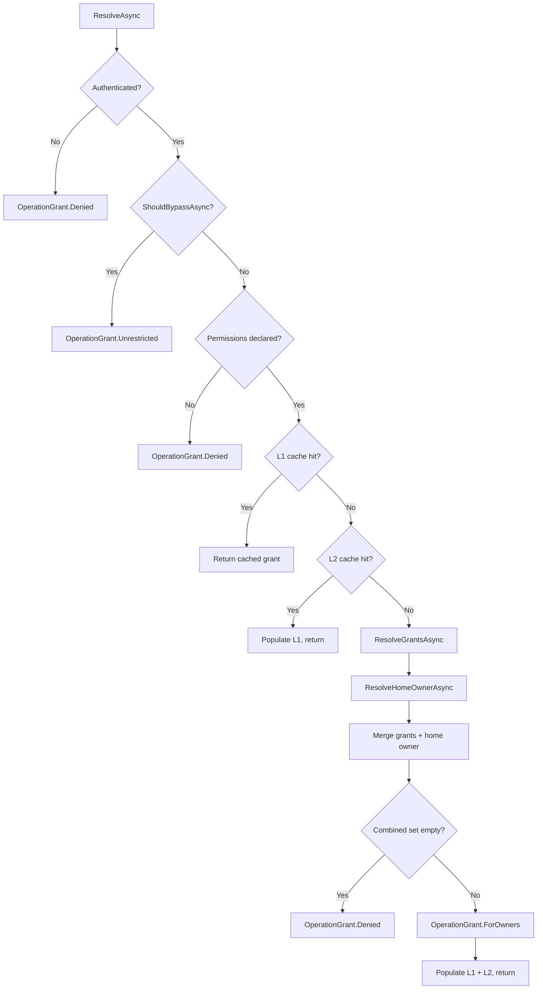

# Grants

> [!NOTE]
> **Read first:** [Authorization](../../README.md) — the user guide. This
> document assumes you understand the three-stage pipeline, `[RequiresGrant]`,
> and `PermissionSet`. It covers grants-specific detail only.

## Grant-Based Access Control

Grants is Cirreum's opt-in **Stage 1 / Step 0** gate. It answers a single
question before the handler runs:

> *"For this operation, which owners can this caller access?"*

The handler never touches the grants table. The app implements
`IOperationGrantProvider` (a thin data lookup); Core orchestrates resolution,
caching, and enforcement. Resources without a granted interface bypass the
gate entirely — zero overhead.

---

## Table of Contents

1. [Core Concepts](#core-concepts)
2. [Component Roles](#component-roles)
3. [Operation Interfaces](#operation-interfaces)
4. [Grant Enforcement](#grant-enforcement)
5. [Grant Resolution Flow](#grant-resolution-flow)
6. [Caching](#caching)
7. [Discovery & Analysis](#discovery--analysis)
8. [DI Registration](#di-registration)
9. [Configuration](#configuration)
10. [Customization Patterns](#customization-patterns)
11. [Design Decisions](#design-decisions)

---

## Core Concepts

| Concept | Description |
|---------|-------------|
| **Grant** | A stored relationship: *"caller X holds permission P on owner Y"* |
| **OperationGrant** | The computed set of owners a caller can touch for a given operation. Three shapes: Denied / Unrestricted / Bounded |
| **Grant Kinds** | Mutate / Lookup / Search / Self — the four grant-aware operation patterns, each with distinct enforcement timing |
| **HomeOwner** | Optional default owner merged into the grant set (e.g., the caller's primary tenant) |
| **Bypass** | App-defined wildcard skip (e.g., super-admin) — produces `Unrestricted`, never cached |

### What Grants Is Not

- **Not RBAC.** Roles live in Stage 2 authorizers. Grants answer *"which owners"*, not *"which actions"*.
- **Not a grant store.** Core defines the pipeline and contracts; the app's `IOperationGrantProvider` queries its own grants table.
- **Not mandatory.** Skip `AddOperationGrants` and the gate is inert.
- **Not Resource ACLs.** Those are object-level, evaluated in-handler — see [Resources](../../Resources/README.md).

---

## Component Roles

```text
┌─────────────────────────────────────────────────────────────────────────────────────┐
│                              App Layer                                              │
│                                                                                     │
│   // Domain derived from namespace: MyApp.Domain.Issues.Commands → "issues"         │
│                                                                                     │
│   public class AppOperationGrantProvider : IOperationGrantProvider            ← App writes            │
│   {                                                                                 │
│       ResolveGrantsAsync(...)  → queries grants table (uses context.DomainFeature)  │
│       ShouldBypassAsync(...)   → admin role check (optional)                        │
│       ResolveHomeOwnerAsync(.) → home tenant (optional)                             │
│   }                                                                                 │
└─────────────────────────────────┬───────────────────────────────────────────────────┘
                                  │
                                  ▼
┌─────────────────────────────────────────────────────────────────────────────────────┐
│                              Core Layer (sealed, no extension points)               │
│                                                                                     │
│   OperationGrantFactory  ← orchestrator                                     │
│     • Bypass check (live, never cached)                                             │
│     • L1 scoped cache → L2 cross-request cache → cold-path resolution               │
│     • Merges grants + home owner → OperationGrant                                      │
│                                                                                     │
│   OperationGrantEvaluator  ← grant enforcement                                               │
│     • Mutate: OwnerId ∈ grant (pre-handler)                                        │
│     • Lookup: stash grant for post-fetch check, or OwnerId ∈ grant when supplied    │
│     • Search: OwnerIds ⊆ grant, stamp when null                                    │
│     • Self: ExternalId == UserId / admin bypass                                     │
│                                                                                     │
│   OperationGrant  ← the gate's output                                                  │
│     • Denied (empty set) / Unrestricted (no bound) / Bounded (explicit owners)      │
└─────────────────────────────────────────────────────────────────────────────────────┘
```

---

## Operation Interfaces

Grants provides composable interfaces that layer on top of existing Conductor operation
types. Each operation pattern requires **one interface** — no marker interfaces or
generic feature parameters:

### Owner-Scoped (tenant/company)

| Interface | Base | Property | Scope |
|-----------|------|----------|-------|
| `IOwnerMutateOperation` | `IAuthorizableOperation` | `OwnerId` (scalar) | Single-owner write (void) |
| `IOwnerMutateOperation<TResultValue>` | `IAuthorizableOperation<TResultValue>` | `OwnerId` (scalar) | Single-owner write with response |
| `IOwnerLookupOperation<TResultValue>` | `IAuthorizableOperation<TResultValue>` | `OwnerId` (scalar) | Single-owner read |
| `IOwnerCacheableLookupOperation<TResultValue>` | `ICacheableOperation<TResultValue>` | `OwnerId` | Cacheable single-owner read |
| `IOwnerSearchOperation<TResultValue>` | `IAuthorizableOperation<TResultValue>` | `OwnerIds` (plural) | Cross-owner query |

### Self-Scoped (user-owned)

| Interface | Base | Property | Scope |
|-----------|------|----------|-------|
| `ISelfMutateOperation` | `IAuthorizableOperation` | `Id` / `ExternalId` | User-owned write (void) |
| `ISelfMutateOperation<TResultValue>` | `IAuthorizableOperation<TResultValue>` | `Id` / `ExternalId` | User-owned write with response |
| `ISelfLookupOperation<TResultValue>` | `IAuthorizableOperation<TResultValue>` | `Id` / `ExternalId` | User-owned read |

### Example

```csharp
// Owner-scoped: which tenant?
[RequiresGrant("delete")]
public sealed record DeleteIssue(string Id) : IOwnerMutateOperation {
    public string? OwnerId { get; set; }
}

[RequiresGrant("read")]
public sealed record GetIssue(string Id) : IOwnerLookupOperation<Issue> {
    public string? OwnerId { get; set; }
}

[RequiresGrant("read")]
public sealed record ListIssues : IOwnerSearchOperation<IReadOnlyList<Issue>> {
    public IReadOnlyList<string>? OwnerIds { get; set; }
}

// Self-scoped: is this mine?
public sealed record GetMyProfile : ISelfLookupOperation<UserProfile> {
    public string? Id { get; set; }
}

public sealed record UpdateMyProfile(string DisplayName) : ISelfMutateOperation {
    public string? Id { get; set; }
}
```

---

## Grant Enforcement

The `OperationGrantEvaluator` enforces timing rules per operation kind:

### Mutate (owner-scoped)

```text
OwnerId supplied  →  OwnerId ∈ grant? Pass : Deny
OwnerId null:
  • Global caller         →  Deny (OwnerId required for cross-tenant writes)
  • Unrestricted grant    →  Deny (OwnerId required — ambiguous target)
  • Single-owner grant    →  Auto-enrich OwnerId from grant, Pass
  • Multi-owner grant     →  Deny (ambiguous — caller must specify)
```

### Lookup (owner-scoped)

Lookups have two distinct patterns the framework supports — **Pattern A** and
**Pattern C** — distinguished by where the ownership check runs and whether
resource existence is hidden from unauthorized callers. Choose based on
whether the *existence* of the resource is itself sensitive.

> [!NOTE]
> **Why no Pattern B?** The alphabet skips intentionally. Pattern A is the
> pre-flight check; Pattern C is the post-fetch check. There is no Pattern B
> because the third option ("pre-flight check, but return 404 on miss") would
> require the framework to lie about whether the owner is in scope before any
> data is loaded — which adds nothing over Pattern A and confuses the response
> contract. Pattern D is similarly not a thing here; data-time ACL evaluation
> via `IResourceAccessEvaluator` is its own concept, not a numbered pattern.

#### Pattern A — Pre-flight enforcement (existence revealed)

The caller supplies `OwnerId` on the request. Stage 1 verifies
`OwnerId ∈ grant` *before* the handler runs and denies on miss.

| Aspect | Behavior |
|---|---|
| Where the check runs | Stage 1, before handler |
| Caller supplies | Non-null `OwnerId` on the operation |
| Response on miss | **403 Forbidden** (`OwnerNotInReach` deny code) |
| Existence handling | Revealed — the caller learns the owner exists but is out of reach |
| Use when | The owner identifier is non-sensitive (caller already knows it from another context — e.g., a tenant subdomain, a known organization slug) |

```csharp
public sealed record GetTenantSettings(string OwnerId, string Key)
    : IOwnerLookupOperation<TenantSettings>;

// Caller invokes with OwnerId = "tenant-acme"
// Stage 1: grant.Contains("tenant-acme")? Yes → handler runs; No → 403
```

The handler doesn't need to consult `IOperationGrantAccessor` for ownership —
Stage 1 already enforced it. (The handler may still read the accessor for
auxiliary dimensions stored in `OperationGrant.Extensions`.)

#### Pattern C — Post-fetch existence-hiding

The caller invokes the operation with `OwnerId == null`. Stage 1 cannot
enforce ownership without knowing the target, so it stashes the resolved
grant on `IOperationGrantAccessor` and *passes*. The handler is then
responsible for fetching the entity and verifying ownership before returning
data.

| Aspect | Behavior |
|---|---|
| Where the check runs | Inside the handler, after the fetch |
| Caller supplies | `null` `OwnerId`; resource identified by some other key (e.g., `Id`, slug) |
| Response on miss | **404 Not Found** — same response as "doesn't exist" |
| Existence handling | Hidden — caller cannot distinguish "doesn't exist" from "exists but you can't access it" |
| Use when | Resource existence is sensitive: financial records, HR data, support tickets, anything where leaking "this ID is real" matters |

```csharp
public sealed record GetIssue(string Id) : IOwnerLookupOperation<Issue>;

public sealed class GetIssueHandler(
    IIssueRepository repo,
    IOperationGrantAccessor grantAccessor)
    : IOperationHandler<GetIssue, Issue> {

    public async Task<Result<Issue>> HandleAsync(GetIssue op, CancellationToken ct) {
        var issue = await repo.GetAsync(op.Id, ct);
        if (issue is null) {
            return Result<Issue>.Fail(new NotFoundException(op.Id));
        }

        // Reading Current sets WasRead = true; satisfies the runtime audit.
        var grant = grantAccessor.Current;
        if (!grant.Contains(issue.OwnerId)) {
            return Result<Issue>.Fail(new NotFoundException(op.Id)); // 404, not 403
        }

        return Result.Ok(issue);
    }
}
```

> [!IMPORTANT]
> Pattern C is the **highest-risk surface** in the grant pipeline. The
> framework cannot enforce the post-fetch check — that's handler code. If the
> handler forgets, the request was permitted at the gate, the entity was
> returned, and no ownership check ever ran. The `GrantedLookupAudit<,>`
> intercept (described below) is the runtime backstop that detects this.

### Decision flow

The Stage 1 evaluator's decision logic for `IGrantableLookupBase` operations:

```text
OwnerId supplied  →  OwnerId ∈ grant? Pass : Deny           [Pattern A]
OwnerId null      →  Stash grant; Pass; handler checks       [Pattern C]
```

For cacheable lookups (`IOwnerCacheableLookupOperation<T>`), the null-OwnerId
branch is denied for `Global`-boundary callers — see
[Permission Model](#permission-model-grants-specific-notes) for why
cross-tenant caching with a null owner would create an unbounded cache
bucket.

### Pattern C runtime audit

Because Pattern C correctness depends on handler code the framework cannot
inspect, the framework ships a `GrantedLookupAudit<,>` intercept as a runtime
backstop. It runs after the handler for every `IGrantableLookupBase` operation,
captures whether the request entered as Pattern A or Pattern C, and watches
the accessor's `WasRead` flag.

If a Pattern C lookup completes without the handler ever reading
`IOperationGrantAccessor.Current`, the intercept emits:

- **Structured warning log** — `PatternCBypassDetected` (EventId 9001) with the
  operation type name
- **OTel activity tag** — `cirreum.authz.grant.pattern_c_bypass = true`

Wire these into your dashboards and alerting so a forgotten `grant.Contains(...)`
call surfaces in dev/CI before a real bypass ships. The audit does not deny
(the handler has already returned by the time it runs) — its purpose is
observability and operational confidence, not enforcement. Pair it with the
`AuthorizationConfigurationException` startup gate for full coverage:
misconfigurations fail fast at boot; missed handler checks surface at runtime.

### Search (owner-scoped)

```text
OwnerIds supplied  →  OwnerIds ⊆ grant? Pass : Deny
OwnerIds null      →  Stamp OwnerIds from grant (unrestricted = null = no bound)
```

### Self (user-owned)

```text
Id null               →  Auto-enrich Id from context.UserId, Pass
Id invalid            →  Deny (ResourceIdRequired)
ExternalId == UserId  →  Pass (identity match — fast path, no resolver)
ExternalId != UserId  →  Resolve grant via ShouldBypassAsync
  • grant.IsUnrestricted  →  Pass (admin bypass)
  • Otherwise             →  Deny (NotResourceOwner)
```

Self-scoped requests perform a direct identity match (`ExternalId == context.UserId`)
without grant resolution for the happy path. Admin bypass is supported via the existing
`IOperationGrantProvider.ShouldBypassAsync` mechanism.

### Pre-flight: User Enabled Check

Before any grant check, the evaluator verifies the application user is enabled
via `IOwnedApplicationUser.IsEnabled`. Disabled users are denied regardless of grants.

---

## Permission Model (Grants-Specific Notes)

The general permission model — `Permission`, `PermissionSet`, the
`[RequiresGrant]` attribute, AND-stacking, namespace-derived feature — is
covered in the [parent README](../../README.md#permission-model). Grants adds
**one extra rule** beyond the general behaviour:

### Cross-Domain Validation

On a granted resource (a type implementing one of the `IGrantable*` interfaces),
all `[RequiresGrant]` permissions **must** use the domain feature derived from
the type's namespace. Mismatches throw `InvalidOperationException` at pipeline
setup:

```csharp
// Type lives in MyApp.Domain.Issues.* → domain feature is "issues"

// Runtime error — feature "audit" does not match domain "issues"
[RequiresGrant("audit", "write")]
public sealed record BadAction : IOwnerMutateOperation { ... }
```

Cross-cutting concerns (audit logging, rate limiting) belong in Stage 2
authorizers or Stage 3 policies — not in grant permissions on a granted
resource.

This rule does not apply to non-granted resources: `[RequiresGrant]` is still
read by `RequiredGrantCache` and surfaced on `ctx.RequiredGrants`, but no
domain enforcement is performed.

---

## Grant Resolution Flow

```text
Hot  (L1 hit):  ResolveAsync → ShouldBypassAsync (live) → L1 dict hit → return
Warm (L2 hit):  ResolveAsync → bypass check → L1 miss → L2 cache hit → L1 populate → return
Cold (miss):    ResolveAsync → bypass check → L1 miss → L2 miss → factory(DB) → L2+L1 populate → return
```

### Resolution Steps



### OperationGrant Shapes

| Shape | `OwnerIds` | Meaning |
|-------|-----------|---------|
| **Denied** | `[]` (empty) | Caller has no access for this operation |
| **Unrestricted** | `null` | No bound — cross-tenant visibility (admin bypass) |
| **Bounded** | `["owner-a", "owner-b"]` | Explicit set of accessible owners |

---

## Caching

### Two-Level Cache

| Level | Scope | Storage | Purpose |
|-------|-------|---------|---------|
| **L1** | DI scope (per-request) | `Dictionary` on scoped resolver | Same user hitting 5 granted operations in one request resolves once |
| **L2** | Cross-request | `ICacheService` | Second request from same user is a cache hit |

### Cache Key Format

```
grant:v{version}:{callerId}:{feaure}:{permissionSignature}
```

- **`callerId`** — covers both C2M (human users with delegated permissions) and M2M
  (service principals with app roles)
- **`feature`** — the namespace-derived feature name (e.g., `issues`)
- **`permissionSignature`** — sorted, `+`-joined permission operation names (e.g., `delete+write`)

**Why the signature is sorted.** When an operation declares multiple permissions
(AND semantics — the caller must hold *all* of them), the *order* in which the
permissions appear in source doesn't change what's being required. Consider two
operations in `MyApp.Domain.Issues.*` that stack the same permissions in
different orders:

```csharp
// Both live in *.Domain.Issues.* — the feature resolves to "issues" for both.
[RequiresGrant("delete")]    // → issues:delete
[RequiresGrant("archive")]   // → issues:archive
public sealed record A : IOwnerMutateOperation { ... }

[RequiresGrant("archive")]   // → issues:archive
[RequiresGrant("delete")]    // → issues:delete
public sealed record B : IOwnerMutateOperation { ... }
```

Both reduce to: *"caller must hold `issues:delete` AND `issues:archive` on the
target owner."* Same precondition, same set of full `Permission` values
(`{issues:archive, issues:delete}`), same DB query.

The signature only needs to encode the **operation names** — every permission
on a granted resource shares the same feature (cross-feature declarations are
rejected at startup), and the feature is already a separate segment of the
cache key. Without sorting, the operation lists would serialize in declaration
order and produce different signatures for the same precondition:

| Operation | Declared order | Signature (unsorted) | Signature (sorted) |
|---|---|---|---|
| A | `[delete, archive]` | `"delete+archive"` | `"archive+delete"` |
| B | `[archive, delete]` | `"archive+delete"` | `"archive+delete"` |

Without sorting, A and B miss each other's cache entries despite asking the
same question — every grant resolution doubles. Sorting normalizes the order
so identical requirements always produce the same key, and the cache hit rate
compounds across related operations.

### Cache Tags

| Tag | Purpose |
|-----|---------|
| `grant:caller:{callerId}` | Invalidate all entries for a user |
| `grant:feature:{feature}` | Invalidate all entries for a feature |

### Grant Resolution Telemetry

`OperationGrantFactory` records grant resolution events via
`AuthorizationTelemetry.RecordGrantResolution()` at every decision point:

| Decision Point | Cache Level Tag | Duration Recorded |
|----------------|-----------------|-------------------|
| Unauthenticated | `denied-early` | No |
| Admin bypass | `bypass` | No |
| No permissions | `denied-early` | No |
| L1 scoped cache hit | `l1-hit` | No |
| L2 cross-request path | `l2` | Yes (ms) |

The L2 duration captures both cache hits (fast) and cold-path resolution
(DB call), giving visibility into cache effectiveness. All instrumentation
is zero-cost when OTel is not attached.

Additionally, the underlying `ICacheService` is wrapped by the
`InstrumentedCacheService` decorator, which separately records cache
hit/miss counters and operation duration at the L2 boundary.

### What's Never Cached

- **Bypass checks** (`ShouldBypassAsync`) — always live. Admin role promotion is immediate.
- **Denied grant** from unauthenticated callers — short-circuit before cache lookup.

### Invalidation

```csharp
// After granting/revoking — invalidate the affected user
await cacheInvalidator.InvalidateCallerAsync(targetUserId);

// After a feature-wide policy change — invalidate all users for that feature
await cacheInvalidator.InvalidateFeatureAsync("issues");
```

---

## Consistency Model

This is the part that determines what your security guarantees actually are. Read it
carefully if you're shipping into a regulated environment.

### The contract

| Surface | Consistency | When it changes |
|---|---|---|
| **`ShouldBypassAsync` (admin/super-admin promotion and revocation)** | **Strong, live.** Never cached, evaluated on every request. | Immediate — adding or removing a caller from the bypass set takes effect on the very next request. |
| **`OperationGrant` resolution (regular grants)** | **Eventually consistent up to L2 TTL.** Cached at L1 (per-request) and L2 (cross-request). | Until the cached entry expires *or* the app calls the invalidator. |
| **Pattern C handler ownership check** | **Strong.** Reads the grant directly from the resolved `OperationGrant` for the current request. | Per-request — no caching at this layer. |

### Why this split

Bypass is the most security-sensitive decision (it grants `Unrestricted` access). Caching
revocation here would mean a freshly de-promoted admin keeps elevated privileges until
TTL expiry — unacceptable. Bypass is cheap (an in-memory role/claim check), so it always
runs live.

Grant resolution involves a database lookup against the app's grants table. Caching is
the difference between sustained throughput and N+1 DB reads per request. Cirreum
chooses **eventual consistency with explicit invalidation** rather than strong
consistency with consistency tokens (which is what Google's Zanzibar / OpenFGA model
gives you, at the cost of a snapshot infrastructure that Cirreum doesn't ship). For most
applications this is the right trade; for high-stakes auth (HIPAA, financial), see the
"When eventual consistency isn't enough" note below.

### Revocation invariants the app owns

When a grant is *revoked* in the app's database, the cached entry is stale until one of
three things happens:

1. **TTL expiry** — the L2 entry expires naturally. Acceptable for non-urgent revocations
   if your TTL is appropriately tight.
2. **Explicit invalidation** — the app calls
   `IOperationGrantCacheInvalidator.InvalidateCallerAsync(callerId)` (or the feature-wide
   variant) at revocation time. Required for prompt revocation.
3. **Version bump** — incrementing
   `Cirreum:Authorization:Grants:Cache:Version` invalidates *every* cached entry
   simultaneously. Useful for major policy changes or as a kill-switch during incident
   response.

> **Cirreum cannot detect revocations on its own.** The framework does not observe the
> app's grants table; the app is responsible for calling the invalidator at revocation
> time. This is documented as an app responsibility in the
> [parent Compliance Boundary section](../../README.md#compliance-boundary). If you
> miss this hook, revocations propagate at TTL speed, not real-time.

### Picking a TTL

Three considerations:

- **Throughput.** Lower TTL → more L2 misses → more DB reads. Tune per environment.
- **Revocation latency.** Higher TTL → longer staleness window if explicit invalidation
  is missed. Treat TTL as the *worst-case* revocation propagation time.
- **Cache invalidation correctness.** If you reliably call the invalidator on every
  grant change, TTL serves only as a backstop. If you don't, TTL becomes your real
  consistency boundary.

Defaults are configurable per-feature via `FeatureOverrides` (see
[Configuration](#configuration)) — a high-throughput read-mostly feature can run a longer
TTL than one with frequent grant churn.

### Cache key hygiene

Cache keys include `version`, `callerId`, `feature`, and `permissionSignature`. Two
implications worth knowing:

- **Same caller, different operations with the same permission set on the same domain
  share a cache entry.** This is intentional and the L2 hit rate compounds across
  related operations.
- **Permissions are sorted into a stable signature** before keying — so
  `[delete, archive]` and `[archive, delete]` collide on the same entry rather than
  miss each other. Without sorting, AND-semantics permissions would silently double the
  miss rate.

### When eventual consistency isn't enough

If your domain requires strong consistency on grant revocation (e.g., immediate
lock-out on termination, regulatory holds), choose one of:

- **Disable L2 caching for that domain.** Set `Expiration = TimeSpan.Zero` in the
  domain override. Grants resolve on every request — full strong consistency at the
  cost of throughput.
- **Aggressive invalidation discipline.** Treat every revocation path in your codebase
  as requiring an `InvalidateCallerAsync` call. Document and enforce via code review;
  consider a wrapper on your grants repository that invalidates on every write.
- **Layer a ReBAC store.** OpenFGA / SpiceDB ship with consistency tokens (Zookies)
  that solve this problem at the data layer. Implement `IOperationGrantProvider`
  against one of those stores and benefit from their snapshot semantics.

The framework gives you the seams — choose the consistency posture that matches your
risk profile.

---

## Discovery & Analysis

Grants integrates into Cirreum's existing authorization discovery and analysis system.
No parallel discovery mechanism is needed.

### Resource Discovery

`DomainModel` automatically detects granted resources during assembly scanning:

- `ResourceTypeInfo.IsGranted` — whether the resource implements a Granted interface
- `ResourceTypeInfo.GrantDomain` — the namespace-derived domain feature
- `ResourceTypeInfo.Permissions` — resolved permissions from `[RequiresGrant]`

These flow through to the serializable `ResourceInfo` export for API transport and
the `DomainCatalog` for organized resource browsing.

### Grant Domain Summary

`DomainSnapshot.Capture()` produces `GrantDomainInfo` records:

```csharp
public sealed record GrantDomainInfo(
    string Domain,                        // e.g., "issues"
    IReadOnlyList<string> Permissions,    // all unique permissions in this domain
    int GrantedResourceCount              // number of resources in this domain
);
```

Admin UIs use this to populate permission-picker dropdowns without reflection.

### GrantedResourceAnalyzer

The analyzer detects grant-specific misconfigurations:

| Check | Severity | Description |
|-------|----------|-------------|
| Missing permissions | Warning | Granted resource without `[RequiresGrant]` — no permission gate |
| Permissions without grants | Info | `[RequiresGrant]` on non-granted resource — declared set available on `ctx.RequiredGrants` for object authorizers |
| No object authorizer | Info | Granted resource without Stage 2 authorizer — grants-only is valid but flagged |
| Unused domains | Info | Namespace domains with no granted resources |
| Mixed authorization | Info | Domain boundary with both granted and non-granted resources — possible incomplete migration |

All metrics flow into the standard `AnalysisReport` and `DomainSnapshot`:

```text
Granted Resources.GrantedResourceCount         = 12
Granted Resources.GrantFeatureCount            = 3
Granted Resources.TotalPermissionCount         = 8
Granted Resources.MissingPermissionCount       = 0
Granted Resources.PermissionsWithoutGrantsCount = 1
Granted Resources.UnsafeCacheableGrantCount    = 0
```

---

## DI Registration

### Single Resolver Registration

```csharp
// Register the app's universal grant resolver
services.AddOperationGrants<AppOperationGrantProvider>();
```

This registers:
- The app's `IOperationGrantProvider`
- Core's `OperationGrantFactory` orchestrator
- Shared infrastructure: `IOperationGrantAccessor`, `OperationGrantResolverSelector`,
  `OperationGrantEvaluator`, cache settings

### Assembly-Scanned Registration

```csharp
// Discover and register the IOperationGrantProvider implementation
services.AddGrantAuthorization(
    configuration: builder.Configuration,
    assemblies: [typeof(Program).Assembly],
    configureCaching: settings => settings.Expiration = TimeSpan.FromMinutes(10));
```

### Idempotency

- Resolver: duplicate `AddOperationGrants` calls are no-ops
- Shared services: registered via `TryAdd` — safe to call repeatedly
- Cache infrastructure: registered once

---

## Configuration

```json
{
  "Cirreum": {
    "Authorization": {
      "Grants": {
        "Cache": {
          "Version": 1,
          "Expiration": "00:05:00",
          "FeatureOverrides": {
            "issues": { "Expiration": "00:10:00" }
          }
        }
      }
    }
  }
}
```

| Setting | Default | Description |
|---------|---------|-------------|
| `Version` | `1` | Bump to invalidate all stale cache entries |
| `Expiration` | inherited from `CacheSettings.DefaultExpiration` | Default cache entry TTL |
| `FeatureOverrides` | `{}` | Per-feature overrides keyed by namespace-derived feature name |

---

## Customization Patterns

### Universal Grant Resolver

The app implements a single `IOperationGrantProvider` that handles all domains. Use
`context.DomainFeature` to route to domain-specific grant logic:

```csharp
public class AppOperationGrantProvider : IOperationGrantProvider {

    // Shared bypass: app-wide super-admin skips grants in every domain
    public ValueTask<bool> ShouldBypassAsync<TAuthorizableObject>(
        AuthorizationContext<TAuthorizableObject> context,
        CancellationToken cancellationToken)
        where TAuthorizableObject : IAuthorizableObject =>
        new(context.EffectiveRoles.Any(r => r.Name == "SuperAdmin"));

    // Domain-aware grant lookup
    public async ValueTask<OperationGrantResult> ResolveGrantsAsync<TAuthorizableObject>(
        AuthorizationContext<TAuthorizableObject> context,
        CancellationToken cancellationToken)
        where TAuthorizableObject : IAuthorizableObject {

        var ownerIds = await db.GetGrantedOwners(
            context.UserId,
            context.DomainFeature,
            context.Permissions);
        return new OperationGrantResult(ownerIds);
    }

    // Home-owner with suspension check
    public ValueTask<string?> ResolveHomeOwnerAsync<TAuthorizableObject>(
        AuthorizationContext<TAuthorizableObject> context,
        CancellationToken cancellationToken)
        where TAuthorizableObject : IAuthorizableObject {

        if (context.UserState.ApplicationUser is IOwnedApplicationUser { IsEnabled: true } user) {
            return new(user.OwnerId);
        }
        return new((string?)null);
    }
}
```

### Extensions for Auxiliary Dimensions

`OperationGrant.Extensions` carries app-specific auxiliary dimensions through the pipeline:

```csharp
public async ValueTask<OperationGrantResult> ResolveGrantsAsync<TAuthorizableObject>(
    AuthorizationContext<TAuthorizableObject> context,
    CancellationToken ct)
    where TAuthorizableObject : IAuthorizableObject {

    var (ownerIds, tiers) = await db.GetGrantsWithTiers(context.UserId, ...);

    return new OperationGrantResult(
        ownerIds,
        Extensions: new Dictionary<string, object> {
            ["allowed-tiers"] = tiers   // e.g., ["gold", "platinum"]
        });
}

// In the handler — read auxiliary dimensions from grant
public async Task<Result<Issue>> Handle(GetIssue request, CancellationToken ct) {
    var grant = grantAccessor.Get();
    var tiers = grant.Extensions?["allowed-tiers"] as IReadOnlyList<string>;
    // Apply as additional predicate scope...
}
```

Extensions are opaque to Core — they flow through the cache and grant accessor
unchanged. Handlers read them via `IOperationGrantAccessor` and apply them as
additional filters.

---

## Design Decisions

### Why Grants Lives in Core

Grants is part of the Conductor authorization pipeline — the same layer that owns
`IAuthorizationEvaluator`, `AuthorizerBase<T>`, and `IAuthorizationConstraint`. Moving
it to a separate package would split the pipeline contract across assemblies. Core
already has identical patterns: settings POCOs, `IConfiguration` binding, assembly
scanning, and `ICacheService`.

### Why Convention-Based Domain Resolution

The domain feature is already structurally encoded in the C# namespace (`*.Domain.Issues.*`).
Requiring a marker interface with `[DomainFeature("issues")]` was redundant ceremony that
added no information the compiler didn't already have. Convention-based resolution via
`DomainFeatureResolver` eliminates the marker interface, the attribute, and the `TDomain`
generic parameter from the entire chain — reducing each granted resource from 5 pieces of
ceremony to 1 interface.

### Why the App Never Touches OperationGrant

`OperationGrant` has three distinguished shapes (Denied / Unrestricted / Bounded) with
subtle edge cases (empty-set collapse, home-owner merge, null semantics). The
orchestrator (`OperationGrantFactory`) handles all translation policy so apps
can't accidentally produce an invalid grant. Apps return `OperationGrantResult` (a simple
owner list) and Core does the rest.

### Why Four Grant Kinds Instead of a Generic "Grant Gate"

Mutate, Lookup, Search, and Self have fundamentally different timing requirements:
- Mutate must know the target owner *before* the handler (no speculative writes)
- Lookup may need to hide existence (Pattern C — check *after* fetch)
- Search operates on sets, not scalars (subset enforcement, auto-stamping)
- Self performs direct identity matching without grant resolution

A single generic gate would either be too permissive or too restrictive. The four kinds
capture the real-world patterns.

### Why Bypass Is Never Cached

Admin role changes must take effect immediately. Caching bypass would mean a newly
promoted admin has to wait for TTL expiry — unacceptable for security-sensitive
operations. Bypass checks are cheap (in-memory role lookup) and always run live.

### Why Permission Sorting Matters

Permissions use AND semantics. `["delete","archive"]` and `["archive","delete"]`
represent the same requirement. Without deterministic sorting, they'd produce different
cache keys and miss each other's entries — causing unnecessary cold-path resolution.

---

## Related Documentation

- [Authorization (parent guide)](../../README.md) — pipeline overview, permission model, core types
- [Authorization Flow](../../FLOW.md) — full request flow from HTTP entry through pipeline exit
- [Pipeline Sequence](../../SEQUENCE.md) — three-stage pipeline internals
- [Resources](../../Resources/README.md) — object-level ACLs (data-time)
- [Operation & Authorization Context](../../../CONTEXT.md) — context architecture and AuthenticationBoundary
