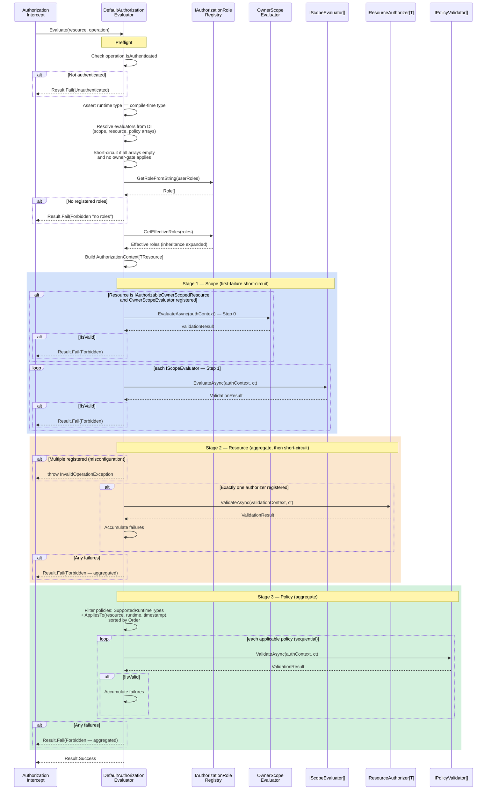

# Authorization Pipeline — Detailed Sequence

Detailed view of the three-stage authorization pipeline executed by
`DefaultAuthorizationEvaluator`. For the high-level request flow showing
where this pipeline fits, see [FLOW.md](./FLOW.md).

## Stage Semantics

| Stage | Purpose | Strategy | Short-circuit |
|---|---|---|---|
| **1 Step 0** — Owner gate | Enforce `OwnerId` presence + match for `IAuthorizableOwnerScopedResource` | First failure | Within Stage 1 |
| **1 Step 1** — Scope evaluators | Tenant / access-scope / ambient constraints | First failure, registration order | Within Stage 1 |
| **2** — Resource authorizer | Role and rule checks specific to this resource type | Single `ResourceAuthorizerBase<T>` per `T`; multiple FluentValidation rules aggregate within it | Stage 2 → Stage 3 |
| **3** — Policy validators | Cross-cutting runtime policies (hours, quotas, kill-switches) | Sequential by `Order`, aggregate within stage | End of pipeline |

## Why the Strategy Differs Per Stage

- **Stage 1 short-circuits aggressively** because scope failures ("wrong
  tenant", "not the owner") make every downstream check meaningless.
- **Stage 2 has a single authorizer per resource type** (by contract),
  but its FluentValidation rules aggregate all failures so developers
  see *every* denial at once (useful during dev/UI iteration). On
  denial, the pipeline **short-circuits** — policies (Stage 3) are
  irrelevant and often expensive (DB / external state) once
  resource-level access is denied.
- **Stage 3 aggregates** to report all failing policies together. Policy
  checks are typically the expensive ones, so by the time we run them
  we've already confirmed Stage 1 and Stage 2 passed; aggregating their
  failures gives callers the complete picture without extra cost.

## Allocation Notes

The hot path is engineered for minimal allocations:

- DI arrays from `GetService<IEnumerable<T>>()!` are cast, not copied.
- Effective roles are computed **once**.
- The failure list is lazily allocated — zero allocations on the
  authorized (happy) path.
- Policy filter + sort is a single-pass walk into a pre-sized `List`.
- Resource-authorizer tasks are stored in a pre-sized `Task[]`.
