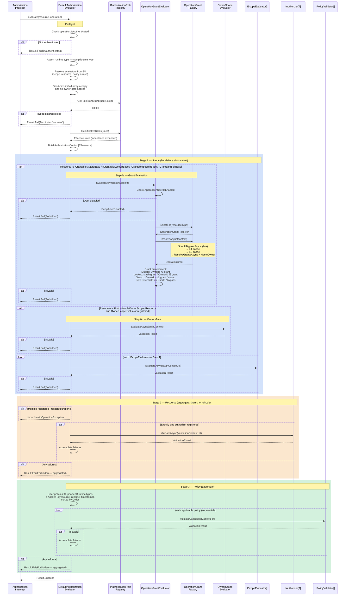

# Authorization Pipeline — Detailed Sequence

Detailed view of the three-stage authorization pipeline executed by
`DefaultAuthorizationEvaluator`. For the high-level request flow showing
where this pipeline fits, see [FLOW.md](./FLOW.md).

## Stage Semantics

| Stage | Purpose | Strategy | Short-circuit |
|---|---|---|---|
| **1 Step 0a** — Grant gate | Resolve `OperationGrant` and enforce grant timing for `IGrantMutateRequest`, `IGrantLookupRequest`, `IGrantSearchRequest`, `IGrantMutateSelfRequest`, `IGrantLookupSelfRequest` | First failure | Within Stage 1 |
| **1 Step 0b** — Owner gate | Enforce `OwnerId` presence + match for `IAuthorizableOwnerScopedResource` | First failure | Within Stage 1 |
| **1 Step 1** — Scope evaluators | Tenant / access-scope / ambient constraints | First failure, registration order | Within Stage 1 |
| **2** — Resource authorizer | Role and rule checks specific to this resource type | Single `AuthorizerBase<T>` per `T`; multiple FluentValidation rules aggregate within it | Stage 2 → Stage 3 |
| **3** — Policy validators | Cross-cutting runtime policies (hours, quotas, kill-switches) | Sequential by `Order`, aggregate within stage | End of pipeline |

## Grant Evaluation Detail

When a resource implements a Granted interface, the `OperationGrantEvaluator` runs as the
first sub-step of Stage 1. Its internal flow:

1. **User enabled check** — `IOwnedApplicationUser.IsEnabled` (immediate deny if disabled)
2. **Grant factory** — `IOperationGrantFactory.CreateAsync(context)` is invoked
3. **Grant resolution** — the factory runs:
   - Bypass check (`ShouldBypassAsync`) — always live, never cached
   - L1 scoped cache lookup (per-request dedup)
   - L2 cross-request cache lookup (`ICacheService`)
   - Cold path: `ResolveGrantsAsync` + `ResolveHomeOwnerAsync` + merge
4. **Grant enforcement** — operation-kind-specific rules (see [Grants README](Grants/README.md))
5. **Grant stashing** — `OperationGrant` set on `IOperationGrantAccessor` for handler access

If no Granted interface is present, the grant gate is a no-op pass with zero overhead.

## Why the Strategy Differs Per Stage

- **Stage 1 short-circuits aggressively** because scope failures ("wrong
  tenant", "not the owner", "no granted access") make every downstream check
  meaningless.
- **Stage 2 has a single authorizer per resource type** (by contract),
  but its FluentValidation rules aggregate all failures so developers
  see *every* denial at once (useful during dev/UI iteration). On
  denial, the pipeline **short-circuits** — policies (Stage 3) are
  irrelevant and often expensive (DB / external state) once
  resource-level access is denied.
- **Stage 3 aggregates** to report all failing policies together. Policy
  checks are typically the expensive ones, so by the time we run them
  we've already confirmed Stage 1 and Stage 2 passed; aggregating their
  failures gives callers the complete picture without extra cost.

## Telemetry

The `DefaultAuthorizationEvaluator` records telemetry via `AuthorizationTelemetry`
at every exit path:

| Exit Path | Metrics Recorded |
|-----------|-----------------|
| Unauthenticated | `RecordDuration(deny, "unauthenticated")` |
| No authorizers | `RecordDuration(deny, "no-authorizers")` |
| No roles | `RecordDuration(deny, "no-roles")` |
| Stage 1 grant gate deny | `RecordDuration(deny, stage=scope)` — OperationGrantEvaluator also calls `RecordDecision` |
| Stage 1 scope evaluator deny | `RecordDecision(scope, scope-evaluator, deny)` + `RecordDuration` |
| Stage 2 resource authorizer deny | `RecordDecision(resource, resource-authorizer, deny)` + `RecordDuration` |
| Stage 3 policy validator deny | `RecordDecision(policy, policy-validator, deny)` + `RecordDuration` |
| Authorized (all stages pass) | `RecordDuration(pass, "pass")` |
| Unexpected error | `RecordDuration(deny, "error")` |

All instrumentation is zero-cost when OTel is not attached — `StartActivity()`
returns null, counters/histograms are no-ops without listeners.

## Allocation Notes

The hot path is engineered for minimal allocations:

- DI arrays from `GetService<IEnumerable<T>>()!` are cast, not copied.
- Effective roles are computed **once**.
- The failure list is lazily allocated — zero allocations on the
  authorized (happy) path.
- Policy filter + sort is a single-pass walk into a pre-sized `List`.
- Resource-authorizer tasks are stored in a pre-sized `Task[]`.
- Grant caching (L1 scoped dictionary) avoids repeated resolution
  when multiple grant-aware operations run in the same request scope.
